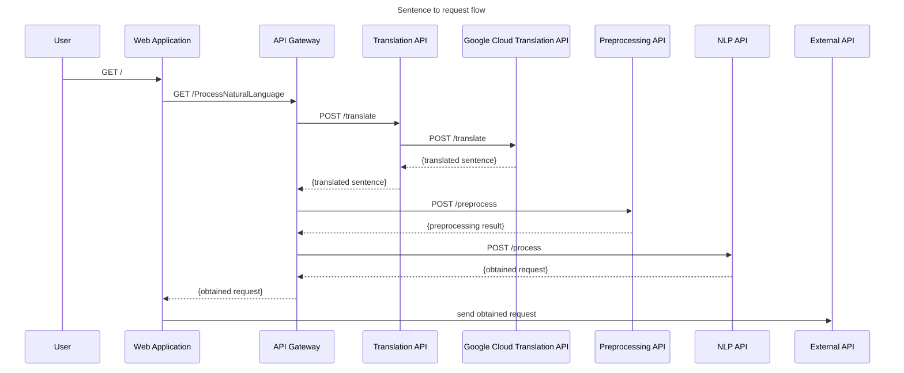

```mermaid
sequenceDiagram
  Title: Sentence to request flow
  User->> Web Application: GET /;
  Web Application ->> API Gateway: GET /ProcessNaturalLanguage;
  API Gateway ->> Translation API: POST /translate
  Translation API ->> Google Cloud Translation API: POST /translate
  Google Cloud Translation API -->> Translation API : {translated sentence}
  Translation API -->> API Gateway: {translated sentence}
  API Gateway ->> Preprocessing API: POST /preprocess
  Preprocessing API -->> API Gateway: {preprocessing result}
  API Gateway ->> NLP API: POST /process
  NLP API -->> API Gateway: {obtained request}
  API Gateway -->> Web Application: {obtained request}
  Web Application ->> External API: send obtained request
  
```